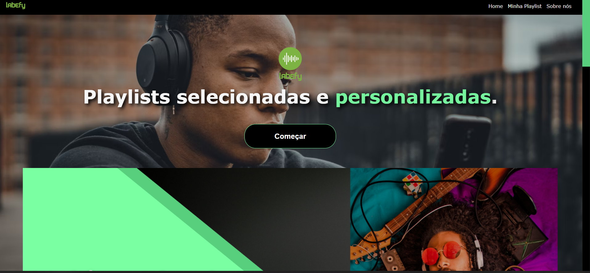
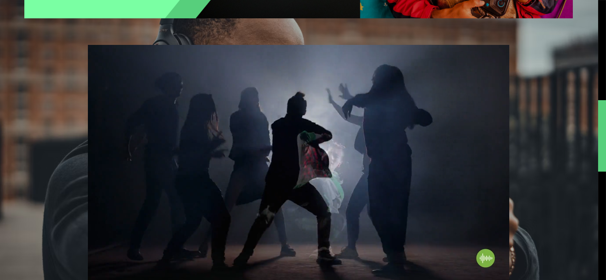
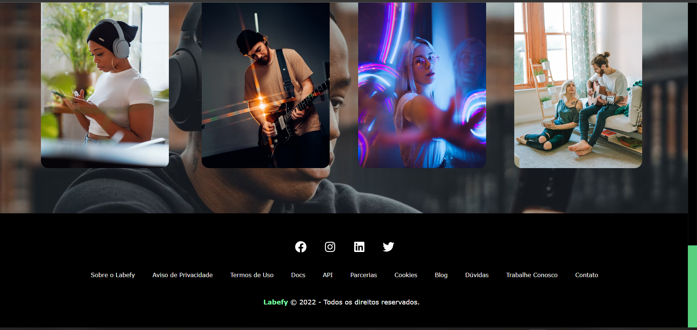
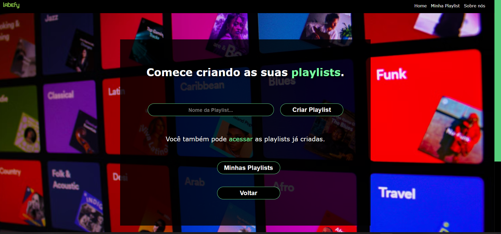
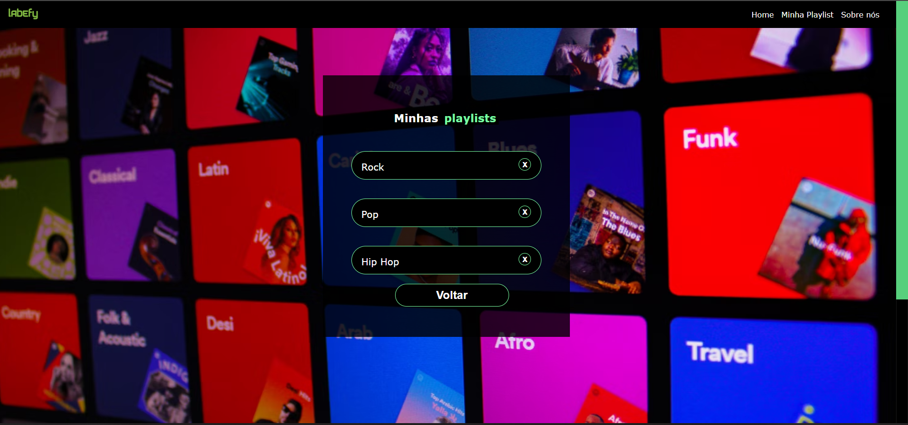
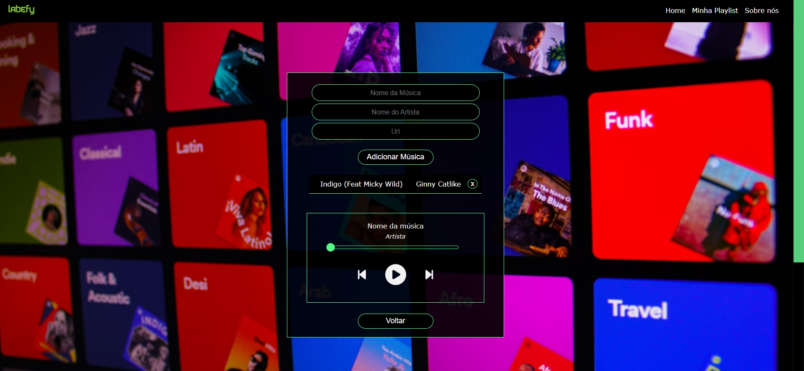
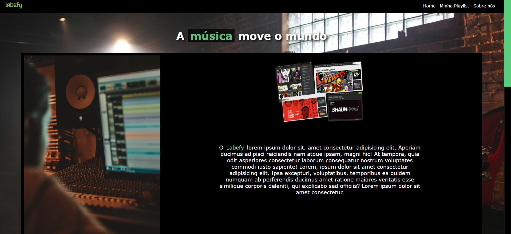
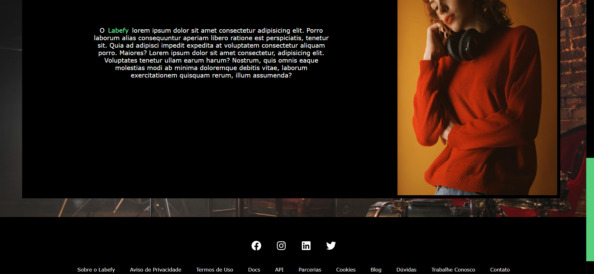
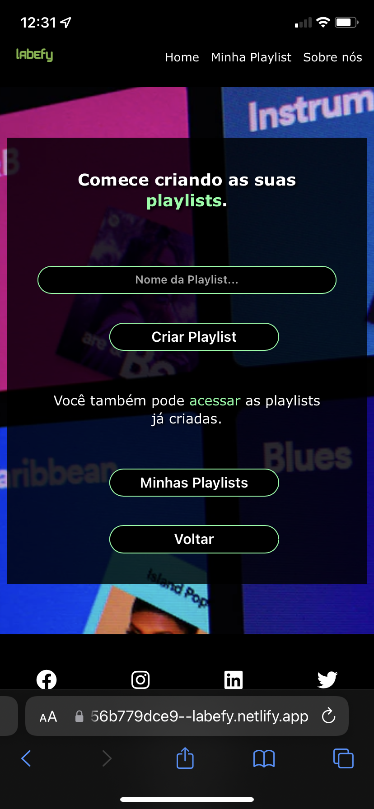
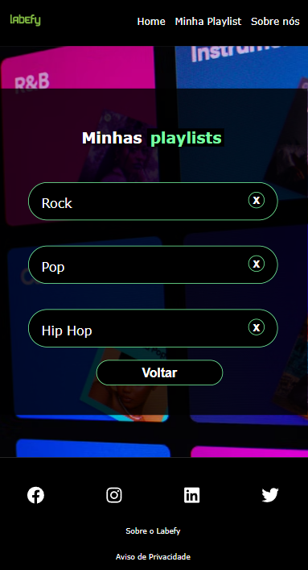

# Projeto Labefy

## 🖖👽 Olá Terráqueos!

Este é um Projeto criado em ReactJs que tem por objetivo aplicar os conhecimentos adquiridos da linguagem.

## 💬 Sobre o projeto:

A ideia central deste projeto é realizar uma integração com a API Labefy, que permite o gerenciamento básico de playlists de músicas. Ao acessar o site o usuário é capaz de criar playlists personalizadas com as suas músicas favoritas. Dentre os recursos disponíveis estão o de criar e deletar playlists, adcionar e excluir músicas e ouvir as músicas adicionadas.

## 👩‍💻 Linguagens Usadas:

* CSS;

* HTML;

* JAVASCRIPT.

## 📚 Bibliotecas Usadas:

* ReactJS;

## ⚙️ API Labefy:

* [Postman](https://documenter.getpostman.com/view/7549981/SztBc8eT#intro)

## 🎵 URL's das Músicas:

* [Palcco MP3](https://www.palcomp3.com.br/)

## 🔗 Link da Hospedagem:

* [Labefy](https://labefy-proejct-v2.surge.sh/)

## 🧰 Recursos

- [X] Menu Superior (header)
    - É possível navegar entre todas as páginas do site, tanto na versão desktop quanto na versão mobile.

- [X] Menu Inferior (footer)
    - É possível acessar link das redes sociais e visualizar outras informações da página (criado como uma forma de deixar a expêriencia mais imersiva durante o uso do site).

- [X] Página Home
    - Botão para acessar a área de playlists;
    - Video ORIGINAL criado somente para o projeto;
    - Informações sobre o conteúdo do site.

- [X] Página de Playlists:
    - O usuário consegue criar ilimitadas playlists adicionando um nome para cada playlist criada (não é permitido  playlists com o mesmo nome);
    - O usuário pode adicionar quantas músicas desejar em suas playlists;
    - Para adicionar uma música, basta prencher os campos solicitados com o nome da música, artista e a url onde se encontra o arquivo de audio. (Só é possivel adicionar músicas que estejam hospedadas na web);
    - Dentro do site é possível adicionar e excluir músicas através dos botões disponíveis em cada trilha musical. 

- [x] Página AboutUs
    - Página estática criada para compor o layout do site.

### Instalação

Para rodar o projeto na máquina local é necessário a instalação do NodeJs:
- [NodeJS](https://nodejs.org/en/download/)

### Rodando a aplicação web
Tendo o NodeJs instalado, efetue os comandos para instalar as dependências necessárias para rodar o projeto localmente:

```
$ npm install 
```

```
$ npm i --save @fortawesome/fontawesome-svg-core
$ npm install --save @fortawesome/free-solid-svg-icons
$ npm install --save @fortawesome/react-fontawesome
```

```
$ npm install react-router-dom@6
```

```
$ npm install axios
```

```
$ npm install react-icons --save
```

```
$ npm install --save styled-components
```

<br/>

Após a instalação das dependências, execute o comando necessário para rodar o projeto:

`npm start`

<br/>

Por padrão a aplicação rodará localmente na porta 3000.

<br/>

### Créditos

* Renan Arimatea 👋🏽 - [LinkedIn](https://www.linkedin.com/in/renan-arimatea/)

## 💻 Desktop Layout











## 📱 Mobile Layout


<br/>

<br/>

<br/>

<br/>

